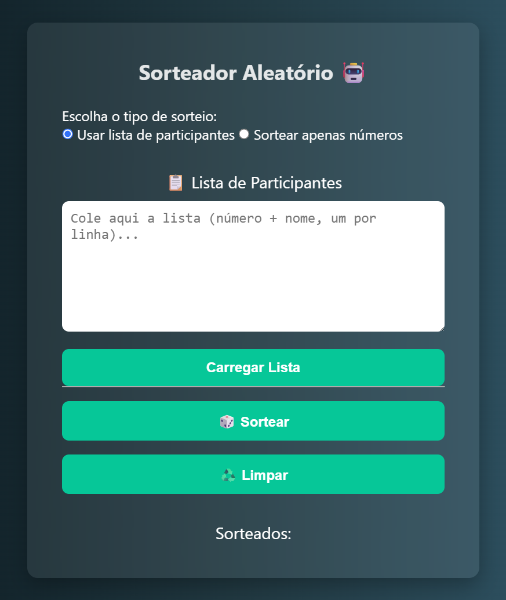
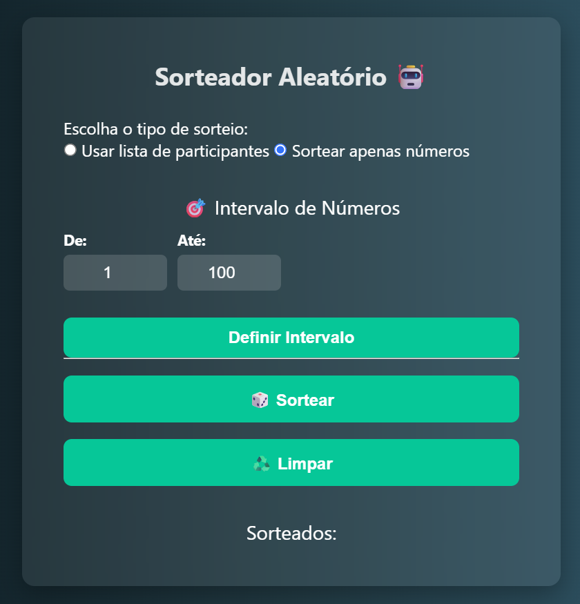

# Sorteador Aleatório 🤖

## Descrição

O **Sorteador Aleatório** é uma aplicação web simples, prática e eficiente para realizar sorteios de forma rápida e justa, ideal para eventos, promoções, turmas, times, e qualquer situação onde você precise selecionar um ou mais ganhadores aleatórios.

### Funcionalidades principais

- **Modo Lista de Participantes:** Cole uma lista de participantes, onde cada linha contém um número e um nome, e carregue para realizar sorteios diretamente dessa lista.
- **Modo Números:** Defina um intervalo numérico (ex: de 1 a 100) e realize sorteios apenas entre esses números, sem nomes associados.
- **Contagem Regressiva Animada:** Antes do sorteio, uma contagem regressiva de 3 segundos com efeitos sonoros para criar suspense.
- **Som Ligado/Desligado:** Controle para ativar ou desativar efeitos sonoros durante o sorteio.
- **Histórico de Sorteados:** Visualização dos números ou nomes já sorteados para acompanhar facilmente quem já foi selecionado.
- **Download do Resultado:** Opção para baixar uma imagem do cartão do resultado para compartilhamento ou registro.
- **Interface Intuitiva e Responsiva:** Layout simples, moderno e funcional para fácil uso em qualquer dispositivo.

---

## Como usar

1. Escolha o tipo de sorteio:  
   - **Usar lista de participantes:** Cole ou importe uma lista no formato `número nome` (ex: `1 João Silva`) e carregue.  
   - **Sortear apenas números:** Defina o intervalo numérico desejado e defina o intervalo.
2. Clique em **Sortear** para realizar o sorteio com contagem regressiva e som (se estiver ativado).
3. Veja o resultado destacado, a lista dos sorteados atualizada e baixe a imagem do resultado se desejar.
4. Use o botão **Limpar** para reiniciar o sorteio e começar novamente.

---

## Tecnologias

- JavaScript / TypeScript
- React (futuro)
- Vite (futuro)
- TailwindCSS para estilização moderna
- HTML5, CSS3 e APIs Web (como Web Audio para som)

---

## Imagens da aplicação

- Tela de inserção da lista de participantes e controle do sorteio
- Tela de sorteio por intervalo numérico

---

## Para Deploy

Por enquanto, o deploy será feito apenas da versão sem React, utilizando a versão pura em JavaScript/HTML/CSS.

---

## Contato

Desenvolvido por Thiago Costa.  
Projeto aberto para contribuições e melhorias.

---

Obrigado por usar o Sorteador Aleatório! 🎲🎉

